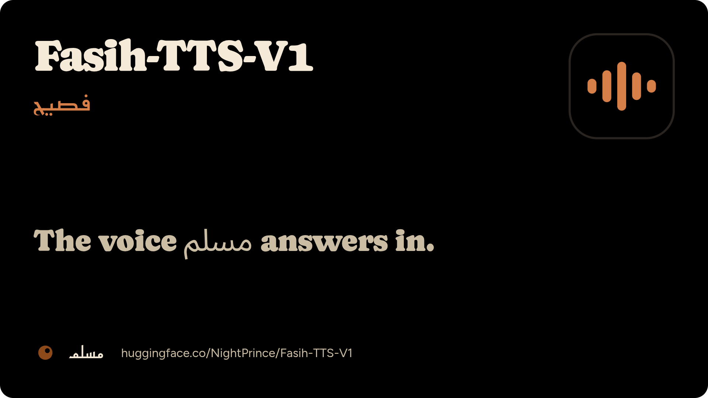
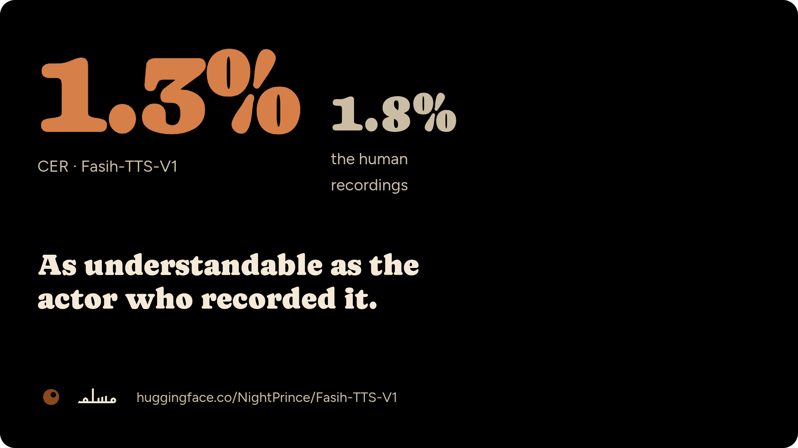
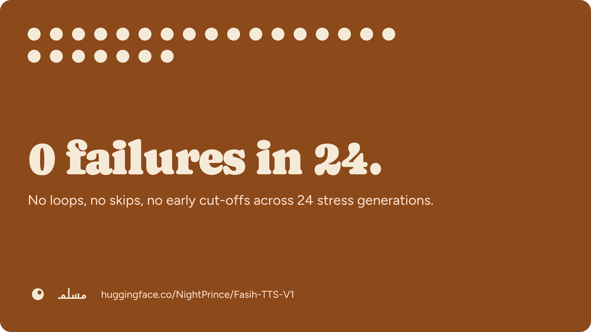
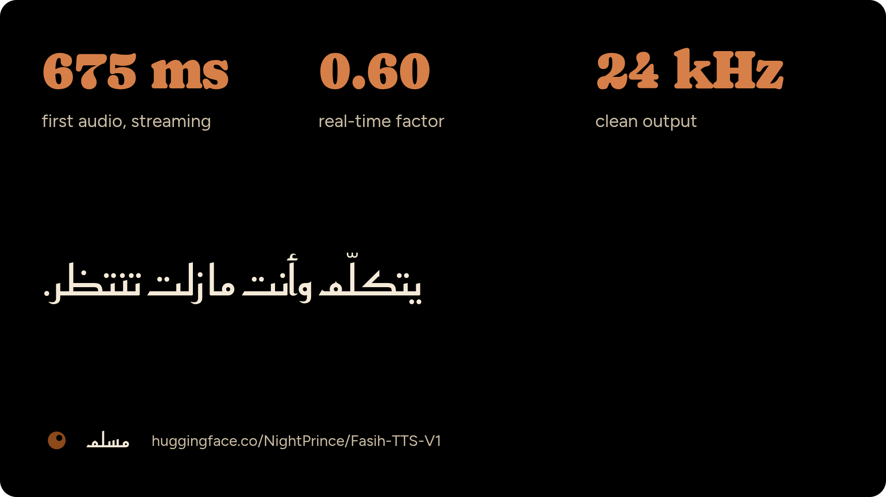
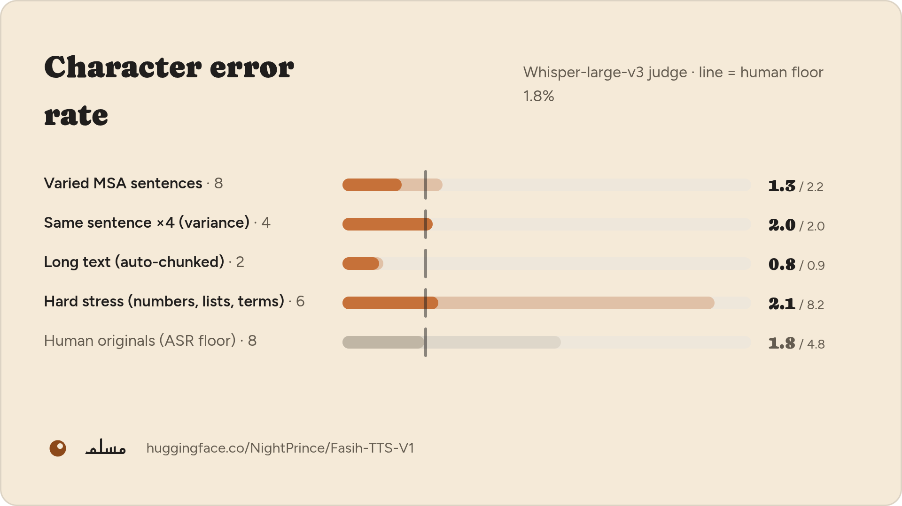
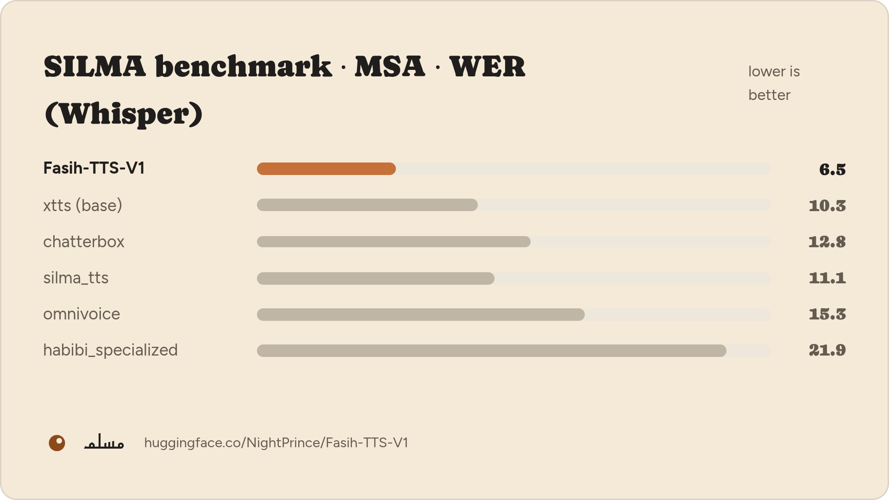
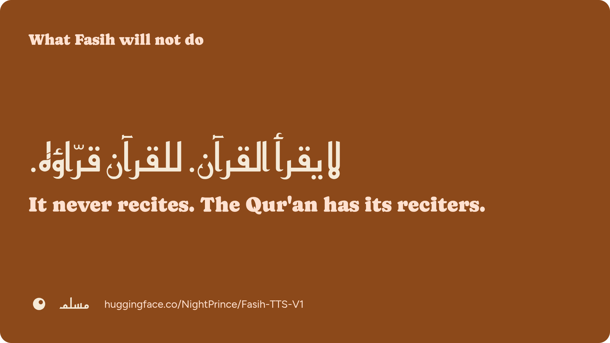

<p align="center">
  
</p>

<h1 align="center">
  
  &nbsp;Fasih-TTS-V1 · فَصِيح
</h1>

<p align="center">
  <b>Modern Standard Arabic (Fusha) text-to-speech with a professional male voice.</b><br/>
  467M parameters · fine-tuned from Coqui XTTS v2 · 24 kHz<br/>
  The full training, evaluation and serving pipeline behind the model.
</p>

<p align="center">
  <a href="https://huggingface.co/NightPrince/Fasih-TTS-V1"></a>
  <a href="https://huggingface.co/spaces/NightPrince/Fasih-TTS"></a>
  <a href="https://arxiv.org/abs/2609.31511"></a>
  <a href="https://huggingface.co/spaces/Navid-AI/Arabic-TTS-Arena"></a>
  <a href="LICENSE"></a>
</p>

**Fasih** (فَصِيح, *"eloquent"*) is a single-speaker Modern Standard Arabic TTS model, fine-tuned
from Coqui XTTS v2. It is the voice of **Muslim (مسلم)**, a religious Q&A assistant. This
repository has everything that produced it: data QC, CATT diacritization, preprocessing,
fine-tuning, CER / WER / UTMOS evaluation, the Arabic text front-end, and the CLI, HTTP and Docker
serving.

- **Weights:** [`NightPrince/Fasih-TTS-V1`](https://huggingface.co/NightPrince/Fasih-TTS-V1)
- **Demo:** [`NightPrince/Fasih-TTS`](https://huggingface.co/spaces/NightPrince/Fasih-TTS)
- **Samples:** [greeting](https://huggingface.co/NightPrince/Fasih-TTS-V1/resolve/main/assets/demo/greeting.mp3) · [fiqh explanation](https://huggingface.co/NightPrince/Fasih-TTS-V1/resolve/main/assets/demo/fiqh.mp3)

---

## At a glance

<table>
  <tr>
    <td width="33%"></td>
    <td width="33%"></td>
    <td width="33%"></td>
  </tr>
  <tr>
    <td><b>Human-level intelligibility.</b> 1.3% CER, below the 1.8% ASR floor measured on the original human recordings.</td>
    <td><b>Stable generation.</b> 0 loops, skips or early cut-offs in 24 stress generations, which are the usual failure modes of XTTS.</td>
    <td><b>Real-time.</b> RTF ≈ 0.60 and ≈ 675 ms to first streamed audio on one RTX 2080 Ti (FP32).</td>
  </tr>
</table>

- **Correct iʿrāb from bare text.** Training text was fully diacritized, and a built-in **CATT**
  diacritizer adds tashkīl to undiacritized input, including case endings.
- **Text front-end for production.** Numbers are expanded to words, a sacred-term lexicon fixes
  religious vocabulary, and long passages are chunked automatically.

---

## Evaluation

### Intelligibility (CER)



Character error rate (CER) between the intended text and a **Whisper-large-v3** transcription of the
synthesized audio. Both sides are diacritics-stripped and orthography-normalized. The human
originals are scored the same way and set the ASR floor.

| Test set | Clips | Mean CER | Worst CER |
|:--|:--:|:--:|:--:|
| Varied MSA sentences | 8 | **1.3%** | 2.2% |
| Same sentence ×4 (variance) | 4 | **2.0%** | 2.0% |
| Long text (auto-chunked) | 2 | **0.8%** | 0.9% |
| Hard stress (numbers, lists, terms) | 6 | 2.1% | 8.2% |
| *Human originals (ASR floor)* | 8 | *1.8%* | *4.8%* |

### SILMA open-source Arabic TTS benchmark



[SILMA's benchmark](https://huggingface.co/spaces/silma-ai/opensource-arabic-tts-benchmark) (MSA,
10 fixed sentences), scored by Whisper-large-v3 and NVIDIA NeMo Arabic FastConformer, plus
**UTMOS** as a naturalness proxy.

| Model | WER · Whisper ↓ | WER · NeMo ↓ | UTMOS ↑ |
|:--|:--:|:--:|:--:|
| **Fasih-TTS-V1** | **6.5** | **2.5** | 3.16 |
| XTTS v2 (base) | 10.3 | **2.5** | 2.99 |
| chatterbox | 12.8 | 5.4 | 3.20 |
| silma_tts | 11.1 | 5.8 | 3.15 |
| omnivoice | 15.3 | 7.3 | **3.62** |
| habibi_specialized | 21.9 | 23.3 | 2.33 |

Fasih has the lowest WER under both judges; with NeMo it ties the base XTTS v2. On naturalness
(UTMOS) it ranks **third**. Per-clip results and all audio are in
[`NightPrince/Fasih-TTS-Benchmark`](https://huggingface.co/datasets/NightPrince/Fasih-TTS-Benchmark).
Reproduce with `scripts/silma_compare.py`, `scripts/nemo_compare.py` and `scripts/utmos_compare.py`.

---

## How it works

```
raw Arabic text ─▶ normalize ─▶ numbers → words ─▶ CATT diacritization ─▶ sacred-term lexicon ─▶ ≤160-char chunks
                                                                                                       │
                       24 kHz speech ◀─ HiFi-GAN decoder ◀─ GPT (fine-tuned) ◀─ shipped speaker latents ◀┘
```

Fasih has **466.9M parameters**. Only the XTTS **GPT** (441.0M) was fine-tuned. The HiFi-GAN decoder and the DVAE stayed frozen. The voice
ships as precomputed conditioning latents (`speaker_latents.pt`), so no reference audio is needed
at inference.

---

## Quick start

### Setup

```bash
cp .env.example .env      # add HF_TOKEN
uv sync --extra xtts --extra diacritize --extra eval --extra serve
uv run python scripts/check_env.py
```

### Synthesize

```bash
# CLI
CUDA_VISIBLE_DEVICES=0 uv run python scripts/say.py "بارك الله فيك" --out outputs/hello.wav

# HTTP API (batch + streaming)
CUDA_VISIBLE_DEVICES=0 uv run uvicorn scripts.serve:app --host 0.0.0.0 --port 8000
curl -X POST localhost:8000/tts -H 'Content-Type: application/json' \
     -d '{"text":"الصلوات المفروضة 5 في اليوم"}' --output out.wav
# /tts/stream → raw PCM16 mono @ 24 kHz for low-latency playback
```

### Docker (GPU microservice)

Model, front-end and the CATT checkpoint are baked into the image at build time, so it starts
offline. See [`fasih_tts_server/`](fasih_tts_server/README.md) for the full API.

```bash
docker build -f fasih_tts_server/Dockerfile -t nightprincey/muslim-fasih-tts:v1 .
docker run --gpus all -p 3006:3006 nightprincey/muslim-fasih-tts:v1
```

---

## Reproduce the pipeline

| Phase | Command |
|:--|:--|
| 1 · Download data | `uv run python scripts/download_data.py` |
| 2 · Quality control | `uv run python scripts/validate_dataset.py` |
| 3 · Diacritize (CATT) | `CUDA_VISIBLE_DEVICES=0 uv run python scripts/diacritize_corpus.py` |
| 4 · Preprocess → 24 kHz + manifests | `uv run python scripts/preprocess_audio.py` |
| 5 · Build LJSpeech layout | `uv run python scripts/build_xtts_dataset.py` |
| 6 · Fine-tune (tmux, resumable) | `scripts/run_xtts_tmux.sh` |
| 7 · Evaluate CER | `CUDA_VISIBLE_DEVICES=0 uv run python scripts/evaluate_cer.py` |

**Parameters:** 466.9M total: GPT 441.0M (fine-tuned) + HiFi-GAN decoder 25.9M (17.8M waveform
decoder + 8.0M speaker encoder, frozen).

**Training setup:** 1297 clips (~2.4 h, one male speaker), GPT-only fine-tune, AdamW at LR 5e-6,
batch 1 × gradient accumulation 24, gradient checkpointing, **FP32** on a single RTX 2080 Ti
(Turing sm_75 has no BF16, and XTTS's GPT is unstable under FP16 autocast). Best validation loss
was 2.622. Training ran on Ubuntu 24.04 / WSL2 with CUDA 12.x, Python 3.12 and uv. Keep the machine
awake during training, because sleep kills CUDA.

The published `model.pth` holds inference-only weights (1.87 GB). Optimizer state and the frozen DVAE
were removed after verifying bit-identical audio.

---

## Repository layout

| Path | Contents |
|:--|:--|
| `configs/` | YAML configs that drive every phase |
| `src/tts/` | Python package: `text/` front-end, `audio/`, `infer/`, `eval/`, `train/` |
| `scripts/` | CLIs for each phase, benchmarks, serving and brand graphics |
| `fasih_tts_server/` | Dockerized FastAPI TTS microservice |
| `space_build/` | Hugging Face Space source |
| `VisionIdentity/` | Brand identity: banners, marks (PNG + SVG), evaluation graphics |
| `docs/` | Per-phase reports and the blog article |
| `tests/` | `uv run pytest` |

`data/`, `models/`, `experiments/`, `outputs/` and `logs/` are gitignored. Weights and private
data are never committed.

---

## Intended use



**In scope:** reading MSA / Fusha explanatory religious and educational content that a qualified
person has written or reviewed.

**Out of scope / prohibited:** Qur'anic recitation (route āyāt to real recordings), autonomous
religious rulings, and impersonation or misinformation.

## Limitations

- Correct iʿrāb needs **diacritized** text. The front-end adds diacritics automatically.
- **Number gender agreement** (`خمسة` vs `خمس`) is not always correct.
- The source audio is **128 kbps MP3**, which limits fidelity.
- Training used ~2.4 h from a single speaker.

---

## License and copyright

- **Code:** MIT.
- **Model weights:** derived from Coqui XTTS v2 and distributed under the
  [Coqui Public Model License](https://coqui.ai/cpml), which allows **non-commercial** use with
  attribution.
- **Diacritizer:** CATT (MIT).

Copyright 2026 **Yahya Elnawasany (NightPrince)**. The Fasih voice, its generated audio, and the
"Fasih / فَصِيح" name and brand identity (`VisionIdentity/`) are copyright the author. See
[`COPYRIGHT`](COPYRIGHT) and [`THIRD_PARTY_NOTICES.md`](THIRD_PARTY_NOTICES.md).

## Citation

Described in [Muslim: A Deployed Arabic Voice AI Platform for Grounded Islamic Knowledge](https://arxiv.org/abs/2609.31511) (arXiv:2609.31511).

```bibtex
@software{fasih_tts_v1_2026,
  author = {Yahya Elnawasany (NightPrince)},
  title  = {Fasih-TTS-V1: Arabic Fusha Professional-Male Text-to-Speech},
  year   = {2026},
  url    = {https://github.com/NightPrinceY/Fasih-TTS-V1},
  note   = {Fine-tuned from Coqui XTTS v2}
}
```

**Author:** Yahya Elnawasany (NightPrince) · https://nightprincey.github.io/Portfolio-App/
