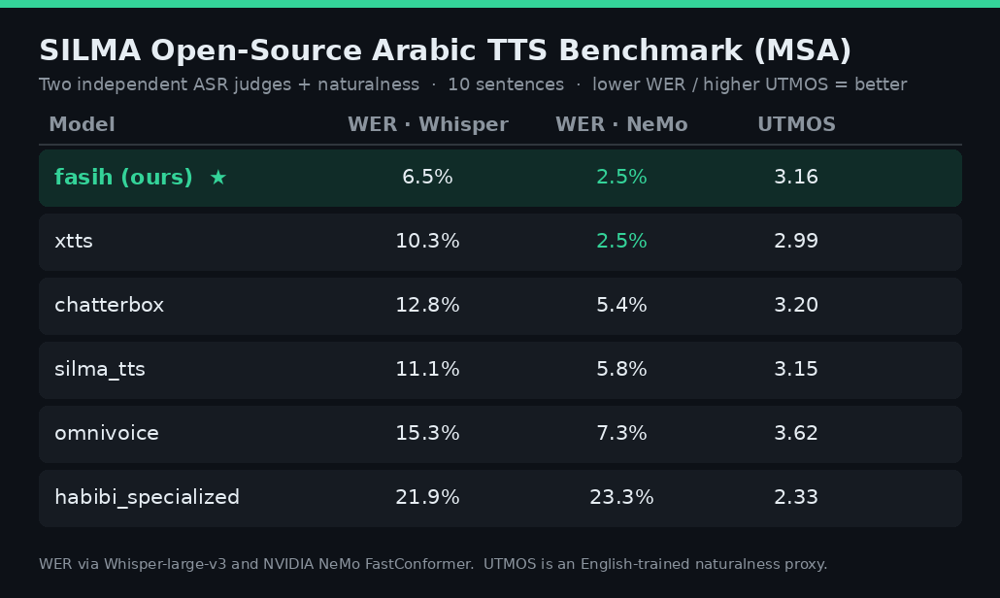

# SILMA Open-Source Arabic TTS Benchmark — Fasih-TTS-V1

Evaluation of Fasih-TTS-V1 on the
[SILMA Open-Source Arabic TTS Benchmark](https://huggingface.co/spaces/silma-ai/opensource-arabic-tts-benchmark)
(MSA split — 10 fixed sentences).

## Methodology

SILMA's benchmark is a **human auditory** comparison; they state that quantitative metrics
(WER, CER, SIM, UTMOS) are "often insufficient for accurately capturing the nuances of Arabic
speech." We therefore treat the numbers below as a **supplementary objective intelligibility
measure**, and also publish Fasih's **audio** on the same 10 sentences for the intended
listening comparison.

- **Sentences:** the 10 MSA sentences from `results/msa/Ar_msa_TTS_benchmark.csv` in the Space.
- **Competitor audio:** downloaded directly from the Space (chatterbox, habibi_specialized,
  omnivoice, silma_tts, xtts).
- **Fasih audio:** synthesized with the full production front-end (auto-diacritization via CATT +
  number expansion + chunking) — `scripts/silma_benchmark.py`.
- **Scoring:** each model's audio transcribed with **Whisper-large-v3**; WER/CER computed against
  the reference text (both diacritics-stripped, orthography-normalized, digits expanded to words)
  — `scripts/silma_compare.py`.

## Results — two ASR judges + naturalness

Scored by **two independent ASRs** (Whisper-large-v3 and NVIDIA NeMo Arabic FastConformer) plus
**UTMOS** naturalness. Using two judges keeps the ranking honest.

| Model | WER · Whisper | WER · NeMo | UTMOS |
|--|:--:|:--:|:--:|
| **Fasih-TTS-V1 (ours)** | **6.5** | **2.5** | 3.16 |
| xtts (base) | 10.3 | 2.5 | 2.99 |
| chatterbox | 12.8 | 5.4 | 3.20 |
| silma_tts | 11.1 | 5.8 | 3.15 |
| omnivoice | 15.3 | 7.3 | 3.62 |
| habibi_specialized | 21.9 | 23.3 | 2.33 |

**Fasih is top-tier on intelligibility** — best-or-tied lowest WER across *both* judges (tied with
base XTTS at 2.5% on NeMo). On **naturalness (UTMOS) it is mid-pack (#3)**; the smoothest model
(omnivoice) is the least accurate. Fasih is tuned toward pronunciation correctness — the priority
for a religious agent. Its Arabic front-end (diacritization + normalization) drives the low WER.

Reproduce: `scripts/silma_compare.py` (Whisper), `scripts/nemo_compare.py` (NeMo, isolated venv),
`scripts/utmos_compare.py` (UTMOS).

**Full provenance (verify it yourself):** every model's per-sentence reference, Whisper
transcription, and WER/CER is in
[`assets/benchmark/silma_msa_detailed.csv`](../assets/benchmark/silma_msa_detailed.csv);
the aggregate is [`assets/benchmark/silma_msa_scores.csv`](../assets/benchmark/silma_msa_scores.csv).
Regenerate end-to-end with `scripts/silma_benchmark.py` (synthesis) + `scripts/silma_compare.py`
(scoring) — competitor audio is pulled straight from SILMA's Space.

## Caveats
- Intelligibility ≠ naturalness. The naturalness ranking requires the human listening comparison;
  Fasih's audio is provided (`assets/benchmark/msa/`) for that.
- One ASR pass, single reference; Whisper itself errs on Arabic (~1–2% CER floor on clean speech).
- Sentence 7 is a Qur'anic verse read as plain MSA text for benchmark comparability — **not**
  tajwīd recitation, which remains out of scope for the model.
